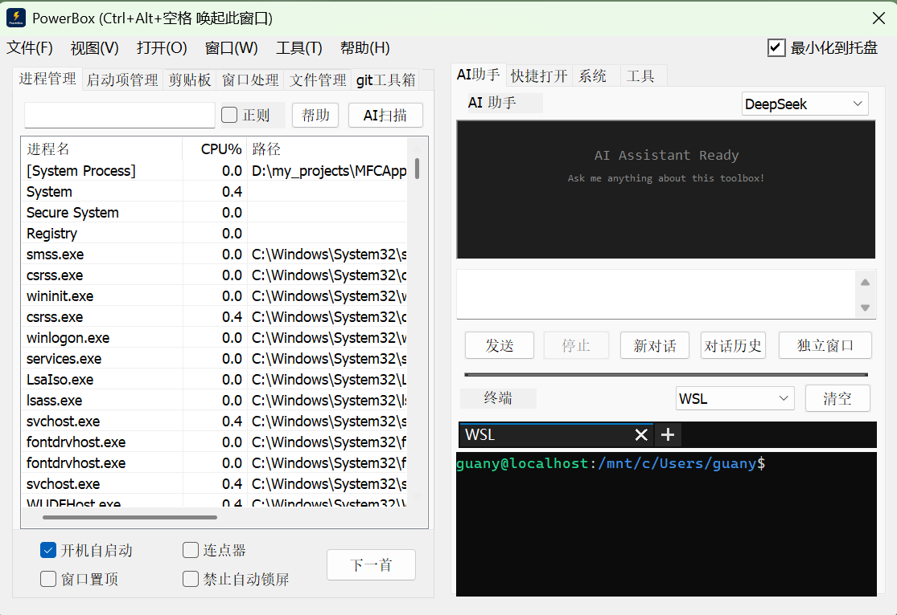
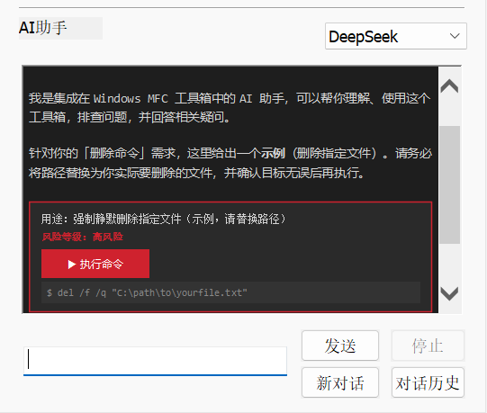
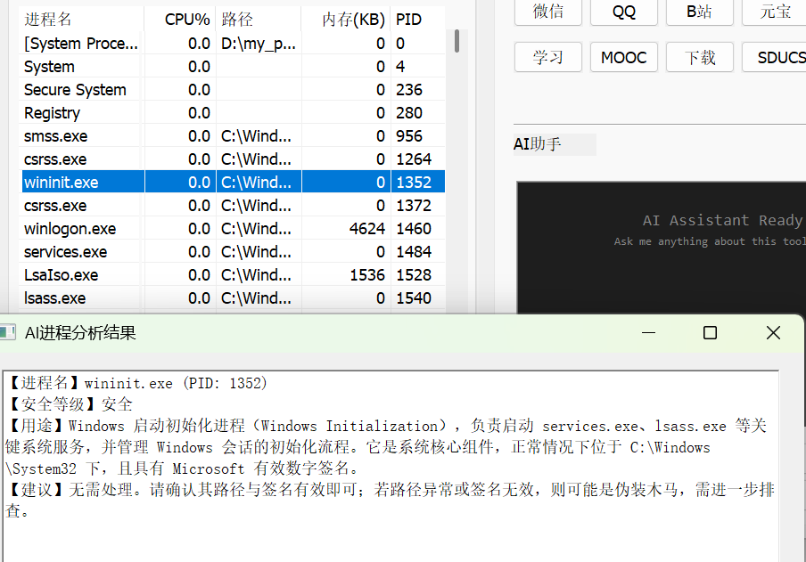
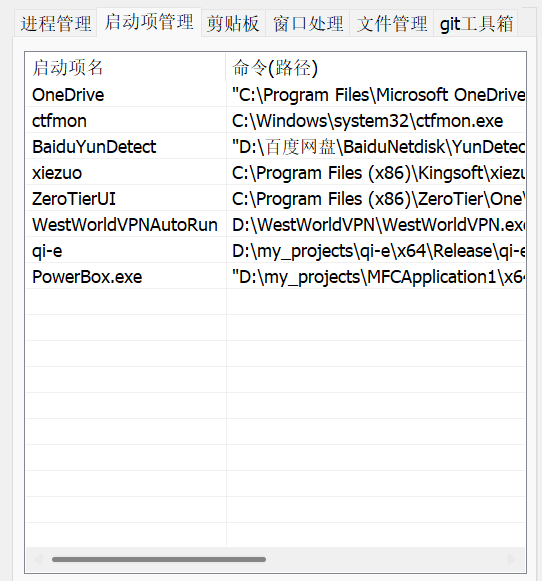
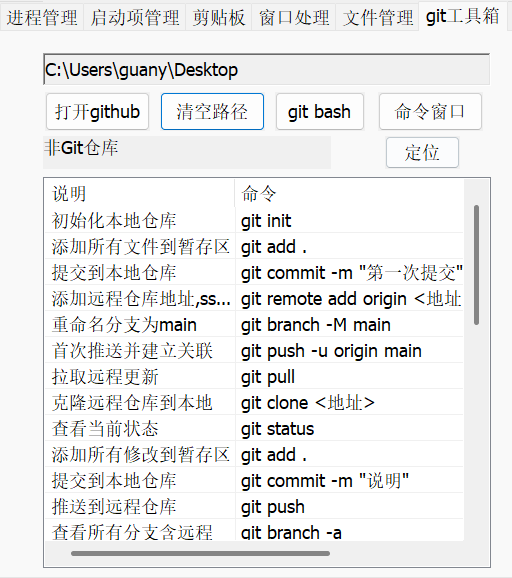
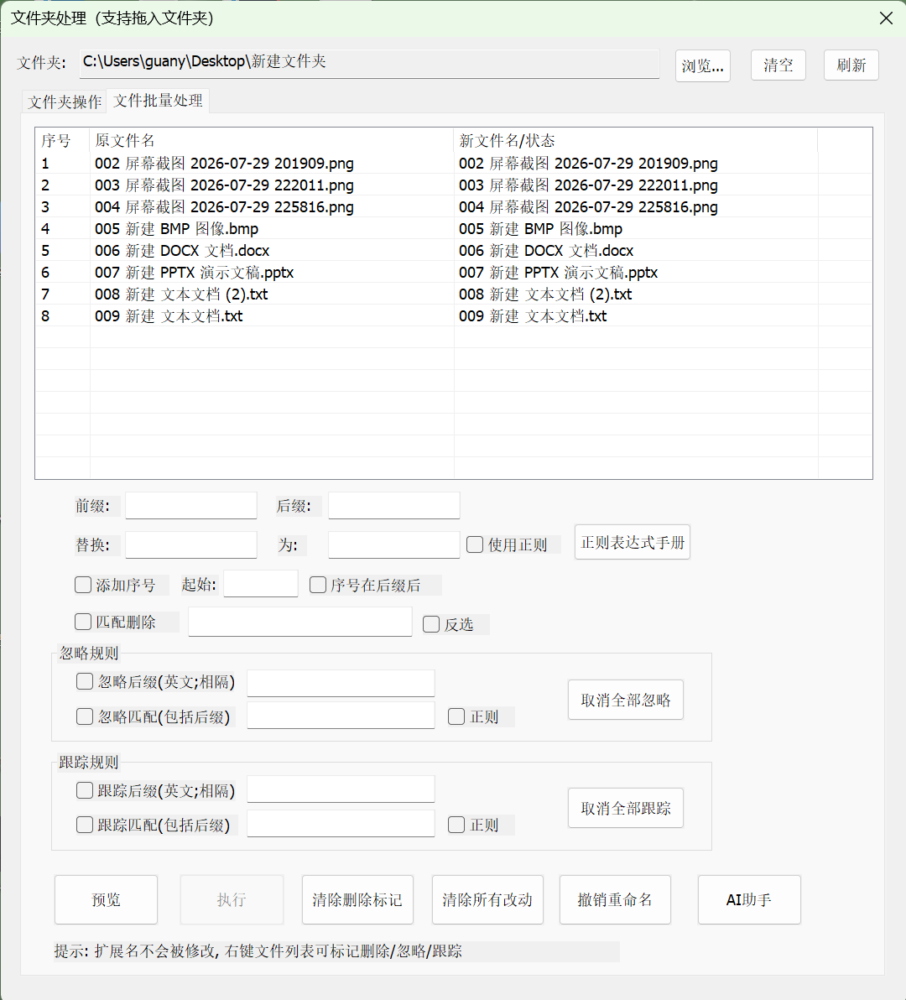
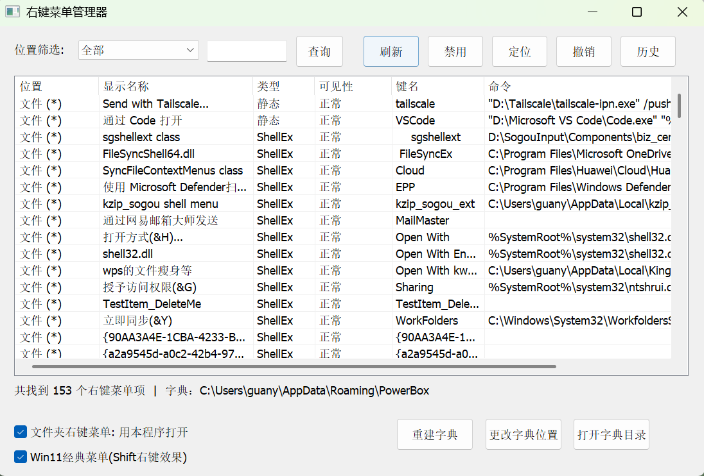
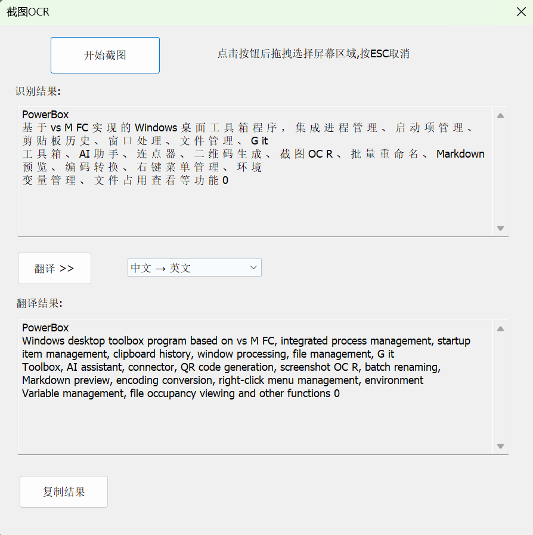
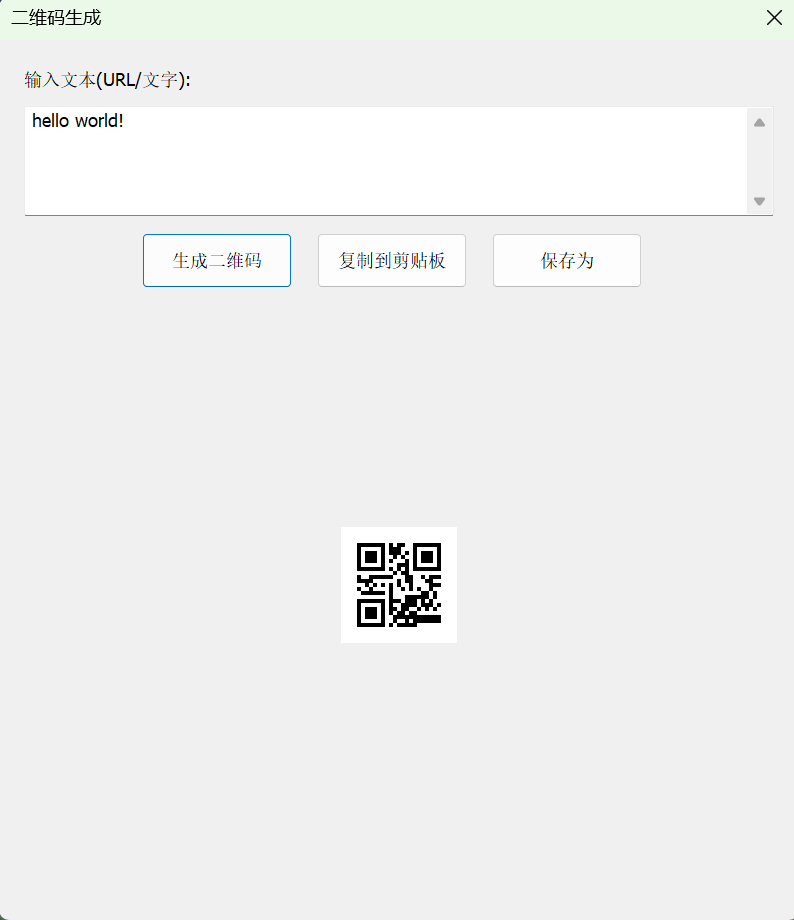

🌐 [English](README.md) · [中文](README.zh-CN.md) · **日本語** · [Русский](README.ru.md) · [한국어](README.ko.md)

---

<p align="center">
  
</p>

<h1 align="center">⚡ PowerBox</h1>

<p align="center">
  <strong>Windows デスクトップツールボックス — AI アシスタント、プロセス管理、スクリーン OCR、Git ツールボックスなど 20 以上のユーティリティを統合</strong>
</p>

<p align="center">
  
  
  
  
  
</p>

<p align="center">
  <a href="https://github.com/gyx114/PowerBox/wiki">📖 Wiki ドキュメント</a>
  ·
  <a href="https://github.com/gyx114/PowerBox/wiki/Quick-Start">🚀 クイックスタート</a>
  ·
  <a href="https://github.com/gyx114/PowerBox/wiki/Feature-Details">📋 機能詳細</a>
  ·
  <a href="https://github.com/gyx114/PowerBox/wiki/AI-Configuration">🤖 AI 設定</a>
  ·
  <a href="https://github.com/gyx114/PowerBox/wiki/FAQ">❓ FAQ</a>
</p>

---

## ✨ 機能概要

### 🧠 AI アシスタント
6 つの AI プロバイダー（OpenAI、DeepSeek、Tongyi Qianwen、Zhipu AI、Moonshot、SiliconFlow）を統合し、マルチモード対話をサポート。

| モード | 説明 |
|------|------|
| AI チャット | 右側パネルで直接対話、ストリーミング出力、Markdown レンダリング、履歴保存/読み込みに対応。スタンドアロン AI アシスタントウィンドウも利用可能 |
| プロセス AI 分析 | プロセスを右クリック → AI 分析、セキュリティ評価と操作推奨を取得 |
| プロセス AI スキャン | ワンクリックですべてのプロセスをスキャン、スキャンレベルを選択後、AI が不審/不要なプロセスを識別、一括終了に対応 |
| AI 一括リネーム | 自然言語で要件を記述、AI が自動的にファイル名マッピングを生成、他のリネームルールと重ねて使用可能 |

AI アシスタントパネルには組み込み ConPTY ターミナルがあり、複数のターミナルセッションをサポート。AI がコマンドを実行するときは自動的にターミナルで実行し、結果を返します。

### 🌐 多言語インターフェース
中国語/英語の切り替えに対応。言語ファイルは `lang/` ディレクトリにあり、自由に拡張可能。詳細は [機能詳細](https://github.com/gyx114/PowerBox/wiki/Feature-Details) の「多言語インターフェース」セクションを参照。

### 📋 コアツール

| ツール | 説明 |
|------|------|
| プロセス管理 | プロセスを列挙、CPU/メモリを表示、ソート/フィルター（正規表現含む）、プロセス終了、ファイル位置特定、AI 分析に対応 |
| スタートアップ管理 | レジストリスタートアップ項目の表示/追加/削除/有効化/無効化、ダブルクリックでパスをコピー、マシンレベルのスタートアップ項目追加に対応 |
| クリップボード履歴 | 最新 10 件のテキストを記録、ダブルクリックで貼り戻し、連続重複エントリは自動重複排除 |
| ウィンドウツール | ウィンドウ特定（Ctrl+Alt+D）、最前面固定（複数ウィンドウ対応）、透明度調整（10%～100%）、強制終了、スクリーンショット保存、特定履歴を自動保存 |
| ファイル管理 | ファイルをドラッグして複製作成（名前カスタマイズ可能）、リネーム、削除（ごみ箱）、コピー、移動。フォルダをドラッグして一括リネームを開く |
| Git ツールボックス | 20 のプリセットコマンド、カスタムリスト対応（config.ini [GitCommands]）、リポジトリブランチを自動検出、AI 支援コマンド生成、Git Bash クイック起動、独立した Git コマンド結果ウィンドウ |

### 🛠 ツール一覧

| ツール | 説明 |
|------|------|
| QR コード生成 | テキストから QR コードを生成、クリップボードにコピーまたは PNG/BMP として保存（4px 白マージン）に対応 |
| スクリーン OCR | 領域選択スクリーンショット、Windows OCR テキスト認識、中国語/英語/日本語/韓国語に対応、MyMemory API 翻訳対応（6 言語ペア） |
| 一括リネーム | 接頭辞/接尾辞/置換/連番/正規表現/一致削除、無視ルールと追跡ルールに対応、AI スマートリネーム、元に戻す、フォルダリネームに対応 |
| 付箋 | 最前面表示付箋、折りたたみ/展開（タイトルバーをダブルクリック）、X ボタンで折りたたみ/終了、内容は設定フォルダに自動保存 |
| Markdown プレビュー | 左右分割エディタ + リアルタイムプレビュー、GitHub スタイル CSS（marked.js）、ドラッグ可能スプリッター、.md ファイルのオープンに対応 |
| エンコーディング変換 | エンコーディング自動検出（UTF-8/UTF-8 BOM/UTF-16LE/UTF-16LE BOM/UTF-16BE/GBK/Big5/Shift-JIS/Latin-1）、一括変換に対応 |
| コンテキストメニュー管理 | コンテキストメニュー項目のスキャン/有効化/無効化、28+ シナリオ、14 の拡張子プリセット + カスタム、未翻訳項目の AI 解析、Win11 クラシックメニュー切り替えに対応 |
| 環境変数管理 | システム/ユーザー環境変数の表示/編集/エクスポート、PATH エディター（独立行編集）、変更前に自動バックアップ |
| ファイルロック確認 | ファイルをドラッグしてロック中のプロセスを表示（Restart Manager API）、プロセス終了/一括終了/プロセスフォルダ位置特定に対応 |
| クイック起動 | ユーザー設定可能なクイックボタン（最大 36 個）、実行ファイル/フォルダ/URL/その他ファイル/ショートカットキーの 5 タイプに対応。実行ファイルは起動ホットキー設定可能、ショートカットキータイプはキーコンビネーションを直接シミュレート。管理ダイアログ付き、ドラッグ＆ドロップ並べ替え、ファイル/フォルダのドラッグ＆ドロップ追加に対応 |
| カスタムホットキー | グローバルホットキー（メインウィンドウ表示/非表示、ウィンドウ特定）を設定でカスタマイズ可能、ホットキーキャプチャダイアログ付き。クイック起動項目は起動ホットキーとショートカットキーシミュレーションに対応 |
| ConPTY ターミナル | AI アシスタントパネル内蔵ターミナル、複数ターミナルセッション、水平タブバー切り替え（Ctrl+Tab/スクロールホイール/中クリック閉じる）、AI が新しいターミナルタブで自動実行 |
| スタンドアロン AI アシスタントウィンドウ | メインウィンドウから独立して使用可能な AI アシスタントウィンドウ、完全なチャット、ターミナル、履歴管理機能を搭載 |

### ⌨️ ショートカット

| ショートカット | 機能 |
|--------|------|
| `Ctrl+Alt+Space` | グローバルホットキー、メインウィンドウ表示/非表示（設定でカスタマイズ可能） |
| `Ctrl+Alt+D` | ウィンドウ特定モードに入る（設定でカスタマイズ可能） |
| `Alt+1` ~ `Alt+6` | 左側サイドバータブを切り替え |
| `F5` | 現在のリストを更新 |
| `Del` | 選択中のプロセスを終了 |
| `Enter` | AI チャットメッセージを送信（AI パネルフォーカス時）。`Shift+Enter` で改行。 |

---

## 🖼️ スクリーンショット

| メイン画面 | AI アシスタント | プロセス管理 |
|:-----:|:------:|:-------:|
|  |  |  |

| スタートアップ管理 | Git ツールボックス | 一括リネーム |
|:---------:|:--------:|:---------:|
|  |  |  |

| コンテキストメニュー管理 | スクリーン OCR | QR コード |
|:----------:|:--------:|:---------:|
|  |  |  |

> その他のスクリーンショットは [docs/screenshots/](docs/screenshots/) ディレクトリをご覧ください。

---

## 📖 ドキュメントナビゲーション

詳細な使用方法と設定ガイドは Wiki をご覧ください：

| ドキュメント | 説明 |
|------|------|
| [📋 機能詳細](https://github.com/gyx114/PowerBox/wiki/Feature-Details) | 各機能モジュールの詳細説明 |
| [🤖 AI 設定](https://github.com/gyx114/PowerBox/wiki/AI-Configuration) | AI プロバイダー設定と API キー取得 |
| [🚀 クイックスタート](https://github.com/gyx114/PowerBox/wiki/Quick-Start) | ダウンロード、インストール、初回使用ガイド |
| [⌨️ ショートカット一覧](https://github.com/gyx114/PowerBox/wiki/Shortcuts) | 全ショートカットキーリファレンス |
| [🔧 ビルドガイド](https://github.com/gyx114/PowerBox/wiki/Build-Guide) | ソースコードからのビルド |
| [❓ FAQ](https://github.com/gyx114/PowerBox/wiki/FAQ) | よくある質問と回答 |

---

## 📥 インストール

### リリースからダウンロード
[Releases ページ](https://github.com/gyx114/PowerBox/releases) から最新の `PowerBox.zip` をダウンロードし、解凍してそのまま使用可能（ポータブルソフトウェア、インストール不要）。パッケージには `PowerBox.exe` と `lang/` 言語フォルダが含まれており、すぐに使用できます。

### ソースコードからビルド
Visual Studio 2022（またはそれ以降）と C++ デスクトップ開発ワークロード（MFC コンポーネント含む）が必要です。

```bash
git clone https://github.com/gyx114/PowerBox.git
cd PowerBox
msbuild MFCApplication1/MFCApplication1.vcxproj /p:Configuration=Release /p:Platform=x64
```

ビルド成果物は `x64/Release/PowerBox.exe` にあります。ビルド後、ソースの `MFCApplication1/lang/` フォルダを exe と同じディレクトリにコピーしてください。コピーしないと、プログラムは組み込みの中国語 UI を使用し、言語を切り替えられません。

---

## 🛠 技術スタック

| カテゴリ | 技術 |
|------|------|
| プログラミング言語 | C++20 |
| UI フレームワーク | MFC (Microsoft Foundation Classes) |
| AI 連携 | WinHTTP + 6 AI プロバイダー（OpenAI、DeepSeek、Tongyi Qianwen、Zhipu AI、Moonshot、SiliconFlow） |
| QR コード | Nayuki QR Code Generator |
| OCR | Windows OCR API (Windows.Media.Ocr) + MyMemory 翻訳 API |
| Markdown | WebBrowser コントロール + marked.js（GitHub スタイル CSS） |
| ターミナル | ConPTY (Windows Pseudo Console) |
| 多言語 | INI ファイル（UTF-16 LE）+ 組み込みデフォルト値、中国語/英語切り替え対応、言語ファイルは `lang/` ディレクトリ |
| ビルド | Visual Studio 2022 + MSBuild |

---

## 📄 ライセンス

[MIT](LICENSE) © 2026 管宇軒